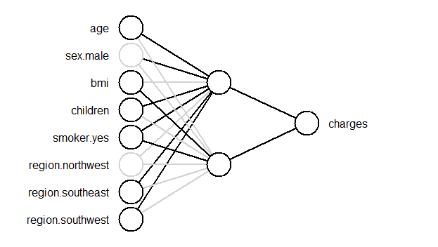
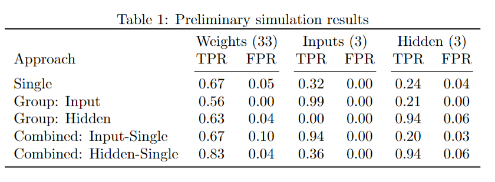
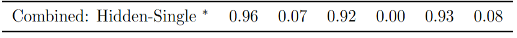

```{r, echo=FALSE, message=FALSE}
library(knitr)
library(fontawesome)
# the default output hook
hook_output <- knit_hooks$get('output')
knit_hooks$set(output = function(x, options) {
  if (!is.null(n <- options$out.lines)) {
    n <- as.numeric(n)
    x <- unlist(stringr::str_split(x, "\n"))
    nx <- length(x) 
    x <- x[pmin(n,nx)]
    if(min(n) > 1)  
      x <- c(paste(options$comment, "[...]"), x)
    if(max(n) < nx) 
      x <- c(x, paste(options$comment, "[...]"))
    x <- paste(c(x, "\n"), collapse = "\n")
  }
  hook_output(x, options)
    })
```

```{r, echo = FALSE}
library(interpretnn)
```


```{r analysis, include=FALSE, cache=TRUE}

# load packages -----------------------------------------------------------
library(interpretnn)
library(caret)
library(selectnn)

set.seed(1)

# load data ---------------------------------------------------------------
insurance <- read.csv("insurance.csv",
                      stringsAsFactors = TRUE)

dummy <- dummyVars(" ~ .", data = insurance)
insurance <- data.frame(predict(dummy, newdata = insurance)) 


# prep data --------------------------------------------------------

std_X <- caret::preProcess(insurance[, c(1, 4, 5)])

std_y <- caret::preProcess(data.frame("charges" = insurance[, 12]))

X <- as.matrix(predict(std_X, insurance[, c(1, 4, 5)]))
X <- cbind(X, insurance[, c(3, 7, 9:11)])
X <- X[, c(1, 4, 2, 3, 5, 6:8)]
y <- as.matrix(predict(std_y, data.frame("charges" = insurance[, 12])))
df <- as.data.frame(cbind(X, y))

# selectnn ----------------------------------------------------------------
set.seed(2)
nn <- selectnn(charges ~ ., data = df, Q = 8, n_init = 5)
summary(nn)


interpretnn.default <- function(object, B = 100, ...) {
  
  stnn <- interpretnn(object$nn, X = object$x, y = object$y, B = B)
  
  return(stnn)
}

# interpretnn -------------------------------------------------------------

n_init <- 10
q <- 2 # achieves VC that is positive definite

lambda <- 0.1


inn <- nn_fit(X, y, q, n_init, maxit = 2000, lambda = lambda)

intnn <- interpretnn.default(inn)

summary(intnn, wald_single_par = TRUE)
```

class: title-slide, left, bottom

# `r rmarkdown::metadata$title`
----
## **`r rmarkdown::metadata$author`**, **`r rmarkdown::metadata$coauthor`**
### `r rmarkdown::metadata$institution`
#### `r rmarkdown::metadata$event`, `r rmarkdown::metadata$date`

---

# Where is Limerick?

--

.pull-left[
```{r, echo=FALSE, out.width="100%", fig.align="center"}
knitr::include_graphics(c("img/limerick-map.png"))
``` 
]


--

```{r, echo=FALSE, out.width="30%", fig.align="right"}
knitr::include_graphics(c("img/limerick-city.jpg"))
``` 


```{r, echo=FALSE, out.width="30%", fig.align="right"}
knitr::include_graphics(c("img/king-johns.jpg"))
``` 


---
# Limerick

--

.pull-left[
```{r, echo=FALSE, out.width="70%", fig.align="center"}
knitr::include_graphics(c("img/hurling.jpg"))
``` 

```{r, echo=FALSE, out.width="40%", fig.align="center"}
knitr::include_graphics(c("img/colmcille.png"))
``` 

]

--

.pull-right[
```{r, echo=FALSE, out.width="85%", fig.align="center"}
knitr::include_graphics(c("img/dolores.jpg"))
``` 
]

---
# Univeristy of Limerick

--

.pull-left[
```{r, echo=FALSE, out.width="100%", fig.align="center"}
knitr::include_graphics(c("img/ul1.jpeg"))
``` 
]
--
.pull-right[
```{r, echo=FALSE, out.width="100%", fig.align="center"}
knitr::include_graphics(c("img/ul2.jpg"))
``` 
]
---
# Background

--

```{r, echo=FALSE, out.width="60%", fig.align="center"}
knitr::include_graphics(c("img/crt-logo.jpg"))
``` 

--

*  Research: Neural networks from a statistical-modelling perspective


--

```{r, echo=FALSE, out.width="70%", fig.align="center"}
knitr::include_graphics(c("img/packages.png"))
``` 


---
class: selectnn-slide
# Model Selection


```{r, echo=FALSE, out.width="90%", fig.align="center"}
knitr::include_graphics("img/modelsel.png")
``` 

A Statistically-Based Approach to Feedforward Neural Network Model Selection (arXiv:2207.04248)

---
class: selectnn-slide
# Insurance: Model Selection 


```{r selection, echo = TRUE, eval = FALSE, out.width="30%"}
library(selectnn)
nn <- selectnn(charges ~ ., data = insurance, Q = 8,
               n_init = 5)
summary(nn)
```

--

```{r summ, echo = FALSE, cache = TRUE, class.output = "bg-primary"}
cat(c("[...]", capture.output(summary(nn))[c(4:7, 10:14)], "[...]"), sep = "\n") 
```

---

class: interpretnn-slide
# Interpreting FNNs

Extend packages: **nnet**, **neuralnet**, **keras**, **torch** 

*  Significance testing

*  Covariate-effect plots 

---

class: interpretnn-slide
# Insurance: Model Summary 


```{r, message = FALSE, eval = FALSE, tidy = FALSE}
intnn <- interpretnn(nn)  
summary(intnn)
```

--

```{r summst, echo = FALSE, cache = TRUE, class.output = "bg-primary"}
s <- summary(intnn, wald_single_par = TRUE)$coefdf
s[, 5] <- round(s[, 5], 4)


cat(c(capture.output(summary(intnn))[9],
      capture.output(print(s[, c(1, 7, 4, 5, 6)], row.names = FALSE)),
      capture.output(summary(intnn))[20:21])
    , sep = "\n") 

```

---

class: interpretnn-slide
# Insurance: Model Summary 


```{r, message = FALSE, eval = FALSE, tidy = FALSE}
plotnn(intnn)
```

--

```{r, echo=FALSE, out.width="70%", fig.align="center"}

``` 

---

class: interpretnn-slide
# Insurance: Covariate Effects 


```{r, eval = FALSE}
plot(intnn, conf_int = TRUE, which = c(1, 4))
```  

--

.pull-left[ 
```{r plot1, cache = TRUE, echo = FALSE, fig.height = 6}
par(mar=c(5,6,4,2)+.1) 
plot(intnn, which = 1, conf_int = TRUE, ylim = c(0, 0.5), cex.axis = 1.7,
     cex.caption = 2.5, cex.lab = 2.2)
```  
]  

--

.pull-right[ 
```{r plot2, cache = TRUE, echo = FALSE, fig.height = 6}
par(mar=c(5,6,4,2)+.1) 
plot(intnn, which = 4, conf_int = TRUE, ylim = c(0, 0.5), cex.axis = 1.7,
     cex.caption = 2.5, cex.lab = 2.2)
```  
] 

---
# Current Work

--

<br>

.pull-left[

```{r, echo=FALSE, out.width="100%", fig.align="center"}
knitr::include_graphics(c("img/kevin-meadhbh.png"))
``` 

]

--


.pull-right[

```{r, echo=FALSE, out.width="100%", fig.align="center"}
knitr::include_graphics(c("img/sic-publication.png"))
``` 

]

---
# Smooth Information Criterion

$$
 \text{IC} = -2\ell(\theta) + \lambda [\lVert \tilde\theta \rVert_0 + 1]
$$

where $\lambda =  \log(n)$ for the BIC.

--

Rearrange as an IC-based penalized likelihood:

$$\ell^{\text{IC}}(\theta) = \ell(\theta) - \frac{\log(n)}{2} [\lVert \tilde\theta \rVert_{0} + 1]$$


---
# Smooth Information Criterion

Introduce "smooth $L_0$ norm":


$$\lVert \theta \rVert_{0, \epsilon} = \sum_{j=1}^p \phi_\epsilon (\theta_j)$$

where

$$
 \phi_\epsilon(\theta_j) = \frac{{\theta_j^2}}{\theta_j^2 + \epsilon^2}
$$

---
# Smooth Information Criterion

```{r, echo=FALSE, out.width="80%", fig.align="center"}
knitr::include_graphics(c("img/smooth-l0.png"))
``` 


---
# Motivation

--

* Tuning parameter automatically selected in one step

<br>

--

* Computationally advantageous 


---
# $\epsilon$-telescoping

--

* Optimal $\epsilon$ is zero

--

* Smaller $\epsilon$ $\implies$ less numerically stable

--

* Start with larger $\epsilon$, and "telescope" through a decreasing sequence of $\epsilon$ values using warm starts


---
# R Package

```{r, echo=FALSE, out.width="70%", fig.align="center"}
knitr::include_graphics(c("img/smoothic.png"))
``` 


---
# Extending to Neural Networks

$$\mathbb{E}(y) = \text{NN}(X, \theta)$$

--

where

$$\text{NN}(X, \theta) = \phi_o \left[ \gamma_0+\sum_{k=1}^q \gamma_k \phi_h \left( \sum_{j=0}^p \omega_{jk}x_{j}\right) \right]$$

---
# Extending to Neural Networks

We can then formulate a **smooth** BIC-based penalized likelihood:

--


\begin{equation*}
  \ell^{\text{SIC}}(\theta) = \ell(\theta) - \frac{\log(n)}{2} [\lVert \tilde\theta \rVert_{0, \epsilon} + q + 1],
\end{equation*}

--
where
\begin{equation*}
  \ell(\theta)= -\frac{n}{2}\log(2\pi\sigma^2)-\frac{1}{2\sigma^2}\sum_{i=1}^n(y_i-\text{NN}(x_i))^2
\end{equation*}


---
# Extending to Group Sparsity

--

The smooth approximation of the $L_0$ norm can be written for groups as 
<!-- $$ -->
<!--  \phi_\epsilon(\theta^{(g)}) = \lvert \theta^{ (g) } \rvert \frac{ {\lVert \theta^{ (g) } \rVert}_2^2}{ {\lVert \theta^{ (g) } \rVert}_2^2 + \epsilon^2}. -->
<!-- $$ -->

$$
 \text{card}(\theta) \times \phi_\epsilon(||\theta||_2^2) = \text{card}(\theta) \times \frac{||\theta||_2^2}{||\theta||_2^2 + \epsilon^2}. 
$$


---
class: inputgroup-slide
# Group Sparisty

## Input-neuron penalization

<!-- \begin{equation*} -->
<!--   \ell^{\text{IN-SIC}}(\theta) = \ell(\theta) - \frac{\log(n)}{2} \left[\sum_{j=1}^{p} \lVert \omega_{j} \rVert_{0, \epsilon} + \lVert \tilde\gamma \rVert_{0, \epsilon} + q + 1\right], -->
<!-- \end{equation*} -->


<font size="6">
\begin{equation*}
  \ell^{\text{IN-SIC}}(\theta) = \ell(\theta) - \frac{\log(n)}{2} \left[q \times \sum_{j=1}^p\big\Vert\Vert\omega_j\Vert_2^2\big\Vert_{0,\epsilon}  + \lVert \tilde\gamma \rVert_{0, \epsilon} + q + 1\right]
\end{equation*}
</font>
where $\omega_{j} = (\omega_{j1},\omega_{j2},\dotsc,\omega_{jq})^T$ 


---
class: hiddengroup-slide
# Group Sparisty


## Hidden-neuron penalization


<!-- \begin{equation*} -->
<!--   \ell^{\text{HN-SIC}}(\theta) = \ell(\theta) - \frac{\log(n)}{2} \left[\sum_{k=1}^{q} \lVert \theta^{(k)} \rVert_{0, \epsilon} + q + 1\right], -->
<!-- \end{equation*} -->

<font size="6">
\begin{equation*}
  \ell^{\text{HN-SIC}}(\theta) = \ell(\theta) - \frac{\log(n)}{2} \left[(p+1) \times \sum_{k=1}^q\big\Vert\Vert\theta^{(k)}\Vert_2^2\big\Vert_{0,\epsilon} + q + 1\right]
\end{equation*}
</font>
where $\theta^{(k)} = (\omega_{1k},\omega_{2k},\dotsc,\omega_{pk}, \gamma_k)^T$


---
# Combined Penalty

* Implement a group penalty and the single-parameter penalty in one optimization procedure  

* Start with group penalization and telescope through the $\epsilon$ values until some predefined value, $\tau$

* Switch to single-parameter penalization for the remainder of the $\epsilon$ values

---
# Approaches

* Single-parameter penalization

* Input-neuron penalization

* Hidden-neuron penalization

* Combined approaches (perform group penalization initially and then switch to single-parameter penalization)

---
# Preliminary Simulation

```{r, echo=FALSE, out.width="100%", fig.align="center"}
knitr::include_graphics(c("img/nn-sim-plot.png"))
``` 

---
# Preliminary Results

```{r, echo=FALSE, out.width="90%", fig.align="center"}

``` 

--

```{r, echo=FALSE, out.width="90%", fig.align="center"}

``` 
---
class: bigger
# References


*  <font size="5">McInerney, A., & Burke, K. (2022). A statistically-based approach to feedforward neural network model selection. <i>arXiv preprint arXiv:2207.04248</i>.  </font>   

*  <font size="5">McInerney, A., & Burke, K. (2023). Interpreting feedforward neural networks as statistical models. <i>To appear on arXiv</i>.    </font> 

*  <font size="5">O’Neill, M. and Burke, K. (2023). Variable selection using a smooth information criterion for distributional regression models. <i>Statistics and Computing, 33(3), p.71</i>.    </font> 


### R Packages  

```{r, eval = FALSE}
devtools::install_github(c("andrew-mcinerney/selectnn",
                           "andrew-mcinerney/interpretnn"))
```


`r fa(name = "github", fill = "#007DBA")` <font size="5.5">andrew-mcinerney</font>   `r fa(name = "twitter", fill = "#007DBA")` <font size="5.5">@amcinerney_</font> `r fa(name = "envelope", fill = "#007DBA")` <font size="5.5">andrew.mcinerney@ul.ie</font>


