```{r, echo=FALSE, message=FALSE}
library(knitr)
library(fontawesome)
# the default output hook
hook_output <- knit_hooks$get('output')
knit_hooks$set(output = function(x, options) {
  if (!is.null(n <- options$out.lines)) {
    n <- as.numeric(n)
    x <- unlist(stringr::str_split(x, "\n"))
    nx <- length(x) 
    x <- x[pmin(n,nx)]
    if(min(n) > 1)  
      x <- c(paste(options$comment, "[...]"), x)
    if(max(n) < nx) 
      x <- c(x, paste(options$comment, "[...]"))
    x <- paste(c(x, "\n"), collapse = "\n")
  }
  hook_output(x, options)
    })
```

```{r, echo = FALSE}
library(interpretnn)
```


```{r analysis, include=FALSE, cache=TRUE}

# load packages -----------------------------------------------------------
library(interpretnn)
library(caret)
library(selectnn)

set.seed(1)

# load data ---------------------------------------------------------------
insurance <- read.csv("insurance.csv",
                      stringsAsFactors = TRUE)

dummy <- dummyVars(" ~ .", data = insurance)
insurance <- data.frame(predict(dummy, newdata = insurance)) 


# prep data --------------------------------------------------------

std_X <- caret::preProcess(insurance[, c(1, 4, 5)])

std_y <- caret::preProcess(data.frame("charges" = insurance[, 12]))

X <- as.matrix(predict(std_X, insurance[, c(1, 4, 5)]))
X <- cbind(X, insurance[, c(3, 7, 9:11)])
X <- X[, c(1, 4, 2, 3, 5, 6:8)]
y <- as.matrix(predict(std_y, data.frame("charges" = insurance[, 12])))
df <- as.data.frame(cbind(X, y))

# selectnn ----------------------------------------------------------------
set.seed(2)
nn <- selectnn(charges ~ ., data = df, Q = 8, n_init = 5)
summary(nn)


interpretnn.default <- function(object, B = 100, ...) {
  
  stnn <- interpretnn(object$nn, X = object$x, y = object$y, B = B)
  
  return(stnn)
}

# interpretnn -------------------------------------------------------------

n_init <- 10
q <- 2 # achieves VC that is positive definite

lambda <- 0.1


inn <- nn_fit(X, y, q, n_init, maxit = 2000, lambda = lambda)

intnn <- interpretnn.default(inn)

summary(intnn, wald_single_par = TRUE)
```

class: title-slide, left, bottom

# `r rmarkdown::metadata$title`
----
## **`r rmarkdown::metadata$author`**, **`r rmarkdown::metadata$coauthor`**
### `r rmarkdown::metadata$institution`
#### `r rmarkdown::metadata$event`, `r rmarkdown::metadata$date`

---
# Background

--

```{r, echo=FALSE, out.width="60%", fig.align="center"}
knitr::include_graphics(c("img/crt-logo.jpg"))
``` 

--

*  Research: Neural networks from a statistical-modelling perspective


--

```{r, echo=FALSE, out.width="70%", fig.align="center"}
knitr::include_graphics(c("img/packages.png"))
``` 


---

# Agenda

--

- Introduction

--

- Model Selection

--

  - Stepwise Selection
  
--

  - Penalised Selection

--
 
- Model Interpretation

--

Slides: [bit.ly/rss-fnn-stat](https://bit.ly/rss-fnn-stat)  


---
class: inverse1 middle center subsection
# Introduction

---

# Background

--

Neural networks originated from attempts to model the human brain.

<br>

--

Early influential papers:

--

-  McCulloch and Pitts (1943)

--

-  Rosenblatt (1958)

--

-  Rumelhart, Hinton and Williams (1986)


---

# Background

Interest within the statistics community in the late 1980s and early 1990s.

--

<br>

Comprehensive reviews provided by White (1989), Ripley (1993), Cheng and Titterington (1994).

--

<br>

However, majority of research took place outside the field of statistics
(Breiman, 2001; Hooker and Mentch, 2021).


---

# Background

Renewed interest in merging statistical models and neural networks.

--


From a statistical viewpoint:

--


-  Distributional regression (Rugamer et al., 2020, 2021).

--

-  Mixed modelling (Tran et al., 2020).

--

From a machine-learning viewpoint:

--

- Neural Additive Models (Agarwal et al., 2020)


---


# Feedforward Neural Networks 

--

.left-column[
```{r, echo=FALSE, out.width="100%", fig.align="center"}
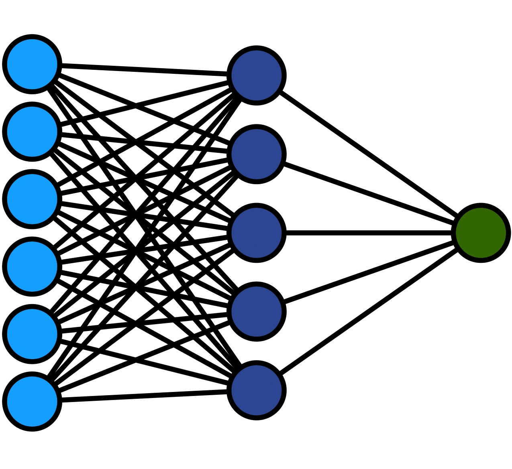
```
]

<!-- 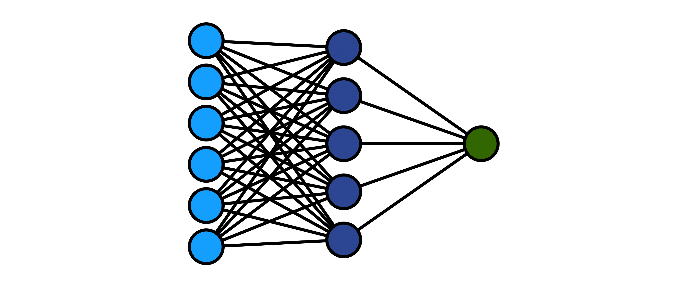
<!--      width="800px" height="350px" -->
<!--      style="position:absolute; right:500px; top:220px;"> -->

<br>


--

.right-column[ 
```{r, echo=FALSE, out.width="95%", out.height="100%", fig.align="right"}
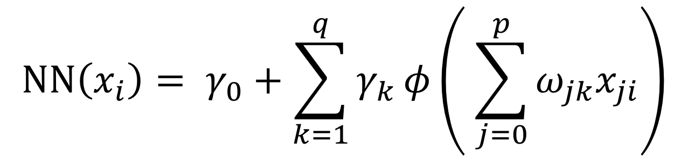
```  
]

---
count: false
# Feedforward Neural Networks 


.left-column[
```{r, echo=FALSE, out.width="100%", fig.align="center"}

```
]

<br>


.right-column[ 
```{r, echo=FALSE, out.width="95%", out.height="100%", fig.align="right"}
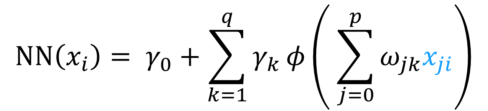
```  
]

---
count: false
# Feedforward Neural Networks 


.left-column[
```{r, echo=FALSE, out.width="100%", fig.align="center"}

```
]

<br>


.right-column[ 
```{r, echo=FALSE, out.width="95%", out.height="100%", fig.align="right"}
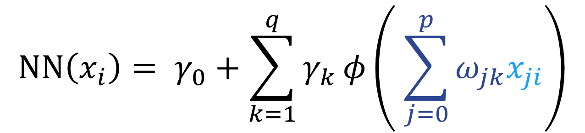
```  
]

---
count: false
# Feedforward Neural Networks 


.left-column[
```{r, echo=FALSE, out.width="100%", fig.align="center"}

```
]

<br>


.right-column[ 
```{r, echo=FALSE, out.width="95%", out.height="100%", fig.align="right"}
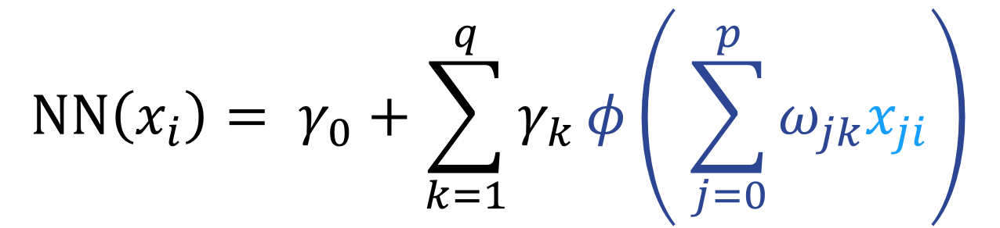
```  
]

---
count: false
# Feedforward Neural Networks 


.left-column[
```{r, echo=FALSE, out.width="100%", fig.align="center"}

```
]

<br>


.right-column[ 
```{r, echo=FALSE, out.width="95%", out.height="100%", fig.align="right"}
knitr::include_graphics("img/nneq5.png")
```  
]


---

# Data Application 

--

### Insurance Data (Kaggle)

--

1,338 beneficiaries enrolled in an insurance plan  

--

 
Response:  
`charges`   

--

6 Explanatory Variables:

`age,` `sex,` `bmi,` `children,` `smoker,` `region` 


---
class: inverse1 middle center subsection
# Model Selection


---
class: inverse1 middle center subsection
## Stepwise Selection

---
# Model Selection

```{r, echo=FALSE, out.width="65%", fig.align="center"}
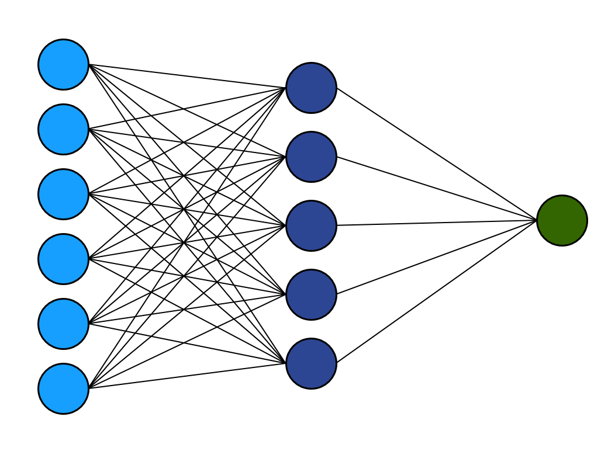
``` 

---
count: false
# Model Selection


```{r, echo=FALSE, out.width="65%", fig.align="center"}
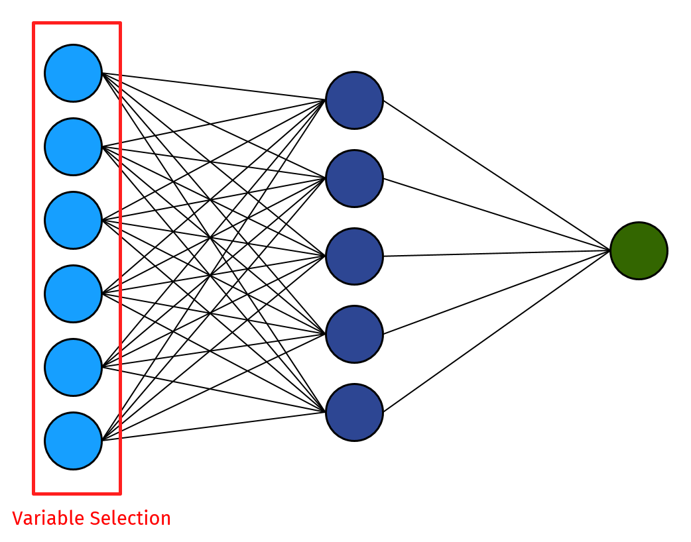
``` 

---
count: false
# Model Selection


```{r, echo=FALSE, out.width="65%", fig.align="center"}
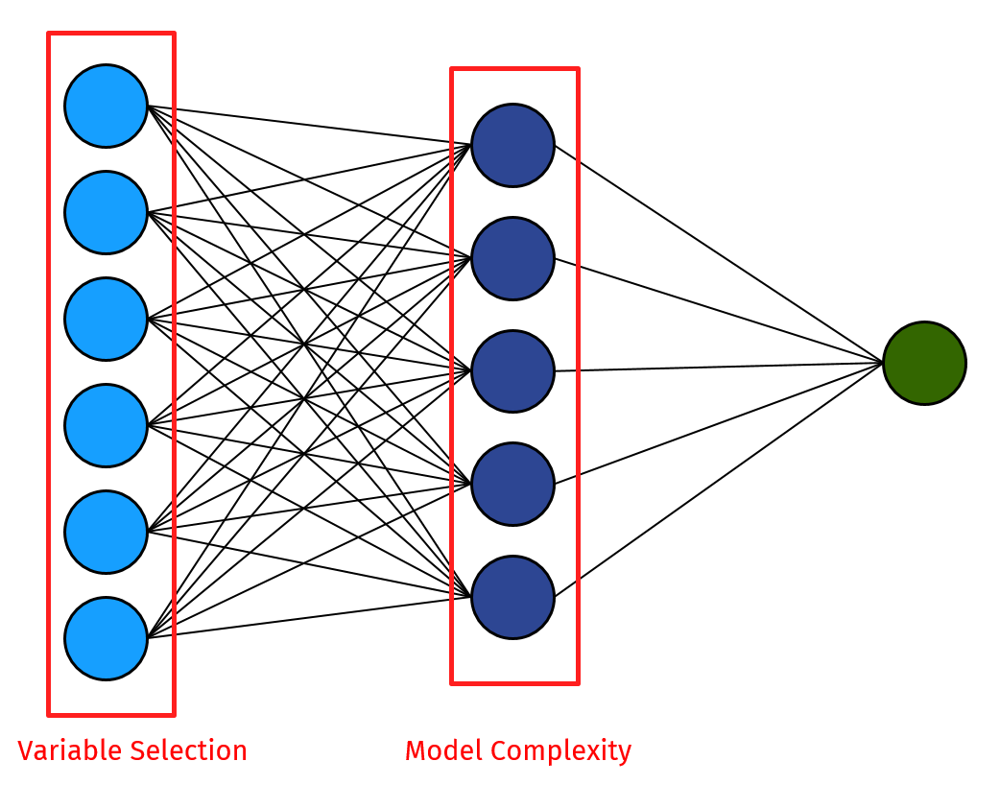
``` 

---
# Proposed Approach

.pull-left[
```{r, echo=FALSE, out.width="100%", fig.align="center"}
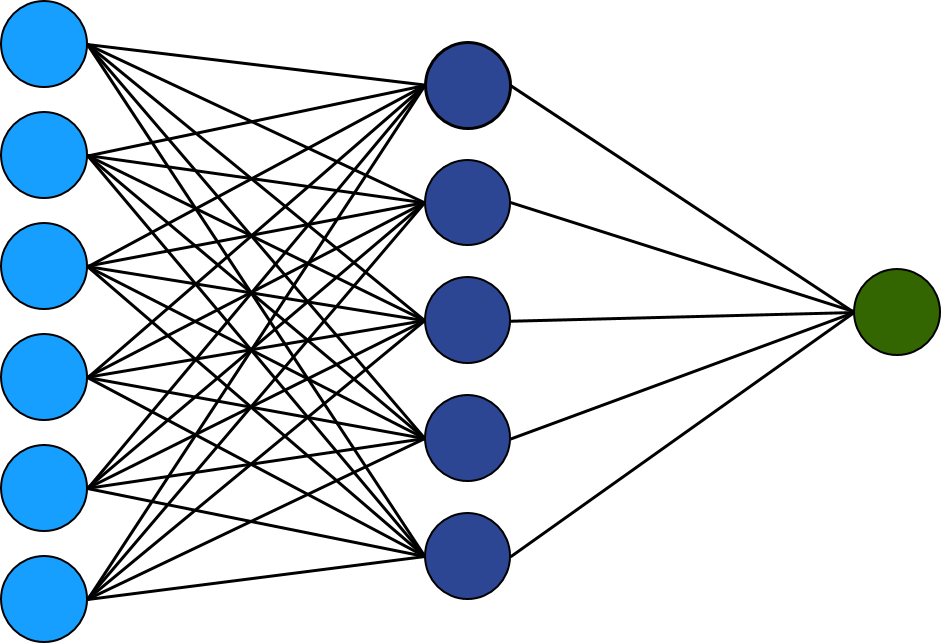
``` 
]
--
.pull-right[
Three phases for model selection:

{{content}}
]

--

1. Hidden-node selection
{{content}}


--

2. Input-node selection
{{content}}

--

3. Fine tuning
{{content}}

---
# Proposed Approach

--
.center[
<figcaption>Hidden Node Selection</figcaption>
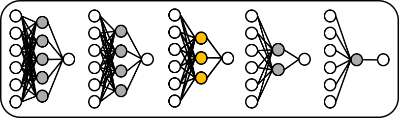
]
--
.center[
<figcaption>Input Node Selection</figcaption>
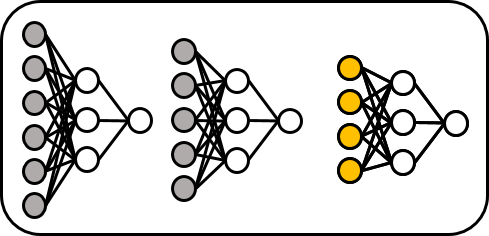
]
--
.center[
<figcaption>Fine Tune</figcaption>
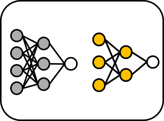
]
---

# Objective Function

--

- Machine Learning:

--

$$
\begin{equation}
\text{Out-of-Sample MSE} = \frac{1}{n_\text{val}}\sum_{i=1}^{n_\text{val}} (y_i - NN(x_i))^2
\end{equation}
$$


--

- Proposed:

--


$$
\begin{equation}
\text{BIC} = -2\ell(\hat{\theta}) + \log(n)(K + 1),
\end{equation}
$$

--

$$
\begin{equation}
K = (p+2)q+1
\end{equation}
$$

---

# Simulation Setup


.pull-left[
<br>


True Model: $p = 3$, $q = 3$

]

---
count: false
# Simulation Setup


.pull-left[
<br>


True Model: $p = 3$, $q = 3$


<br>

No. unimportant inputs: $10$


]


---
count: false
# Simulation Setup


.pull-left[
<br>


True Model: $p = 3$, $q = 3$


<br>

No. unimportant inputs: $10$


<br>

Max no. hidden nodes: $10$

]

--

.pull-right[
```{r, echo=FALSE, out.width="90%", fig.align="center"}
knitr::include_graphics("img/simFNN.png")
``` 
]

---

# Simulation Results: Approach

--

```{r, echo=FALSE, out.width="65%", fig.align="center"}
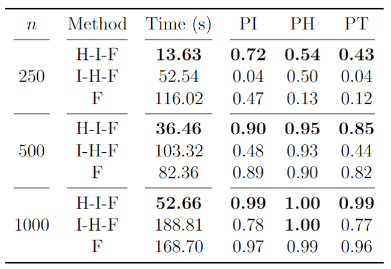
``` 

---
# Simulation Results: Objective Function

--

```{r, echo=FALSE, out.width="50%", fig.align="center"}
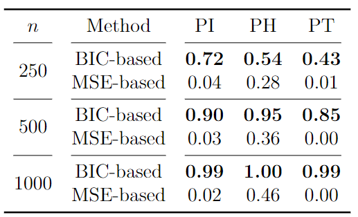
``` 

--
```{r, echo=FALSE, out.width="70%", fig.align="center"}
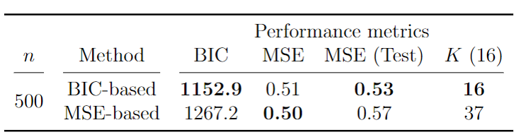
```

---
class: selectnn-slide
# Model Selection


```{r, echo=FALSE, out.width="90%", fig.align="center"}
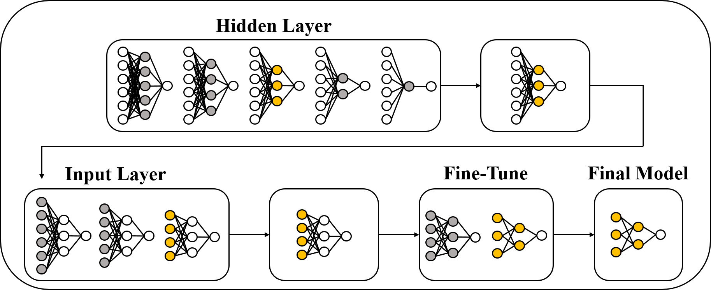
``` 

A Statistically-Based Approach to Feedforward Neural Network Model Selection (arXiv:2207.04248)

---
class: selectnn-slide
# Insurance: Model Selection 


```{r selection, echo = TRUE, eval = FALSE, out.width="30%"}
library(selectnn)
nn <- selectnn(charges ~ ., data = insurance, Q = 8,
               n_init = 5)
summary(nn)
```

--

```{r summ, echo = FALSE, cache = TRUE, class.output = "bg-primary"}
cat(c("[...]", capture.output(summary(nn))[c(4:7, 10:14)], "[...]"), sep = "\n") 
```


---
class: inverse1 middle center subsection
## Penalised Selection


---
# Smooth Information Criterion

--

```{r, echo=FALSE, out.width="100%", fig.align="center"}
knitr::include_graphics(c("img/sic-publication.png"))
``` 


---
# Smooth Information Criterion

$$
 \text{BIC} = -2\ell(\theta) + \log(n) \left[ \sum_{j=1}^p |\beta_j|^0 + 1 \right]
$$


--

where

\begin{equation*}
  \ell(\theta)= -\frac{n}{2}\log(2\pi\sigma^2)-\frac{1}{2\sigma^2}\sum_{i=1}^n(y_i-x_i^T\beta)^2
\end{equation*}


---
# Smooth Information Criterion

$$
 \text{BIC} = -2\ell(\theta) + \log(n) \left[ \sum_{j=1}^p |\beta_j|^0 + 1 \right]
$$


--

Introduce "smooth BIC":

--

$$
 \text{SBIC} = -2\ell(\theta) + \log(n) \left[ \sum_{j=1}^p \frac{{\beta_j^2}}{\beta_j^2 + \epsilon^2} + 1 \right]
$$


---
# Smooth Information Criterion

```{r, echo=FALSE, out.width="100%", fig.align="center"}
knitr::include_graphics(c("img/smooth-l0.jpg"))
``` 


---
# $\epsilon$-telescoping


$$
 \text{SBIC} = -2\ell(\theta) + \log(n) \left[ \sum_{j=1}^p \frac{{\beta_j^2}}{\beta_j^2 + \epsilon^2} + 1 \right]
$$


--

* Optimal $\epsilon$ is zero

--

* Smaller $\epsilon$ $\implies$ less numerically stable

--

* Start with larger $\epsilon$, and "telescope" through a decreasing sequence of $\epsilon$ values using warm starts


---
# R Package

```{r, echo=FALSE, out.width="100%", fig.align="center"}
knitr::include_graphics(c("img/smoothic.png"))
``` 


---
# Extending to Neural Networks

$$\mathbb{E}(y) = \text{NN}(X, \theta)$$

--

where

$$\text{NN}(X, \theta) = \phi_o \left[ \gamma_0+\sum_{k=1}^q \gamma_k \phi_h \left( \sum_{j=0}^p \omega_{jk}x_{j}\right) \right]$$

---
# Extending to Neural Networks

<p style="font-size: 0.85em">
$$
 \text{SBIC} = -2\ell(\theta) + \log(n) \left[ \sum_{jk} \frac{\omega_{jk}^2}{\omega_{jk}^2 + \epsilon^2} + \sum_{k} \frac{\gamma_k^2}{\gamma_k^2 + \epsilon^2} + q + 1 \right]
$$
</p>

--
where

<p style="font-size: 1em">
$$
  \ell(\theta) = -\frac{n}{2}\log(2\pi\sigma^2)-\frac{1}{2\sigma^2}\sum_{i=1}^n(y_i-\text{NN}(x_i))^2
$$
</p>


---
# Simulation Setup


```{r, echo=FALSE, out.width="50%", fig.align="center"}
knitr::include_graphics(c("img/sim-setup.png"))
``` 


---
# Results

```{r, echo=FALSE, out.width="90%", fig.align="center"}
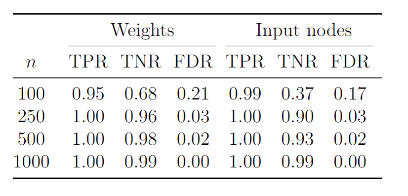
``` 


---
# Extending to Group Sparsity

--

.pull-left[
```{r, echo=FALSE, out.width="100%", fig.align="center"}
knitr::include_graphics(c("img/input-group.png"))
```
]

--
Single penalty:

\begin{equation*}
 \frac{\omega_{jk}^2}{\omega_{jk}^2 + \epsilon^2}
\end{equation*}

--

Group penalty:

$$
 \text{card}(\omega_j) \times \frac{||\omega_j||_2^2}{||\omega_j||_2^2 + \epsilon^2} 
$$


---
class: inputgroup-slide
# Group Sparsity

## Input-neuron penalization

<p style="font-size: 0.78em">
$$
 \text{IN-SBIC} = -2\ell(\theta) + \log(n) \left[ q \times \sum_{j}\frac{||\omega_j||_2^2}{||\omega_j||_2^2 + \epsilon^2} + \sum_{k} \frac{\gamma_k^2}{\gamma_k^2 + \epsilon^2} + q + 1 \right]
$$
</p>

where $\omega_{j} = (\omega_{j1},\omega_{j2},\dotsc,\omega_{jq})^T$ 


---
class: hiddengroup-slide
# Group Sparsity


## Hidden-neuron penalization


<p style="font-size: 0.78em">
$$
 \text{HN-SBIC} = -2\ell(\theta) + \log(n) \left[ (p + 1) \times \sum_{k}\frac{||\theta^{(k)}||_2^2}{||\theta^{(k)}||_2^2 + \epsilon^2} + q + 1 \right]
$$
</p>


where $\theta^{(k)} = (\omega_{1k},\omega_{2k},\dotsc,\omega_{pk}, \gamma_k)^T$


---
# Simulation Setup


```{r, echo=FALSE, out.width="50%", fig.align="center"}
knitr::include_graphics(c("img/sim-setup.png"))
``` 


---
# Results (IN-SBIC)

```{r, echo=FALSE, out.width="90%", fig.align="center"}
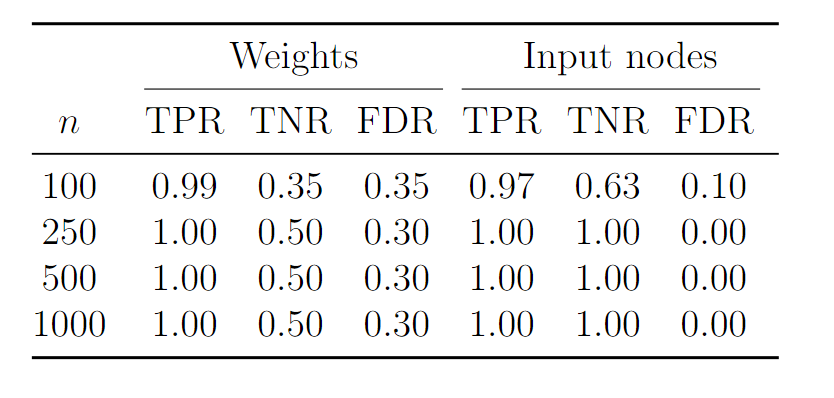
``` 


---
# Data Application - Results

```{r, echo=FALSE, out.width="100%", fig.align="center"}
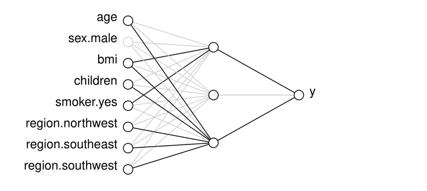
``` 


---
class: inverse1 middle center subsection
# Model Interpretation


---

# R Implementation

--

Many packages available to fit neural networks in R.

<br>
--

Some popular packages are:

--

-  `nnet`

--

-  `neuralnet`

--

-  `keras`

--

-  `torch`

---

# R Implementation: nnet

--

```{r nnet, echo = TRUE, eval = FALSE}
library(nnet)
nn <- nnet(charges ~ ., data = insurance, size = 2, maxit = 2000,
           linout = TRUE)
summary(nn)
```

--

```{r nnetmodel, eval = TRUE, echo = FALSE, class.output = "bg-primary", cache=TRUE}
cat(c(capture.output(summary(inn$nn))[-2], "[...]"),
    sep = "\n")
```


---


# Proposed Solution: interpretnn

--

.left-column[ 
<br>
```{r, echo=FALSE, out.width="80%", fig.align="center"}

``` 
]

--

.right-column[
<br>
<br>
.small[
```{r, echo=TRUE, eval = FALSE}
# install.packages("devtools")
library(devtools)
install_github("andrew-mcinerney/interpretnn")
``` 
]
]

---

# Statistical Perspective

--

$$
y_i = \text{NN}(x_i) + \varepsilon_i, 
$$

--

where

$$
\varepsilon_i \sim N(0, \sigma^2)
$$

--

$$
\ell(\theta, \sigma^2)= -\frac{n}{2}\log(2\pi\sigma^2)-\frac{1}{2\sigma^2}\sum_{i=1}^n(y_i-\text{NN}(x_i))^2
$$

--

Achieve uncertainty quantification through $I_o(\hat{\theta})$
<!-- --- -->

<!-- # Uncertainty Quantification -->

<!-- Then, as $n \to \infty$ -->

<!-- $$ -->
<!-- \hat{\theta} \sim N[\theta, \Sigma = \mathcal{I}(\theta)^{-1}] -->
<!-- $$ -->

<!-- -- -->

<!-- Estimate $\Sigma$ using -->

<!-- $$ -->
<!-- \hat{\Sigma} = I_o(\hat{\theta})^{-1} -->
<!-- $$ -->

<!-- -- -->

<!-- <br>   -->

<!-- However, inverting $I_o(\hat{\theta})$ can be problematic in neural networks. -->
<!-- --- -->

<!-- --- -->
<!-- # Redundancy -->

<!-- -- -->

<!-- Redundant hidden nodes can lead to issues of unidentifiability for some of the parameters (Fukumizu 1996). -->

<!-- <br> -->

<!-- -- -->

<!-- Redundant hidden nodes $\implies$ Singular information matrix. -->

<!-- <br> -->

<!-- -- -->

<!-- Trade-off between model flexibility and interpretability. -->


---

# Significance Testing

--

.pull-left[
```{r, echo=FALSE, out.width="98.9%", fig.align="center"}

``` 
]

---
count: false
# Significance Testing


.pull-left[
```{r, echo=FALSE, out.width="100%", fig.align="center"}
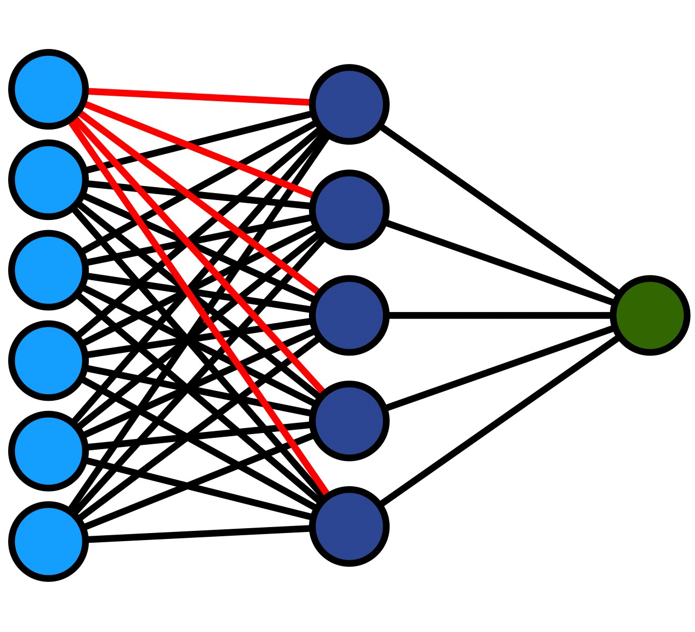
``` 
]

--

.pull-right[
  Wald test:
  
  {{content}}
  
  ]

--

$$
\begin{equation}
 \omega_j = (\omega_{j1},\omega_{j2},\dotsc,\omega_{jq})^T
\end{equation}
$$
{{content}}

--

$$
\begin{equation}
 H_0: \omega_j = 0
\end{equation}
$$
{{content}}

--

$$
\begin{equation}
 (\hat{\omega}_{j} - \omega_j)^T\Sigma_{\hat{\omega}_{j}}^{-1}(\hat{\omega}_{j} - \omega_j) \overset{\mathcal{D}}{\longrightarrow} \chi^2_q
\end{equation}
$$
{{content}}


---


# Insurance: Model Summary 


```{r, message = FALSE, eval = FALSE, tidy = FALSE}
intnn <- interpretnn(nn)  
summary(intnn)
```

--

```{r summst, echo = FALSE, cache = TRUE, class.output = "bg-primary"}
s <- summary(intnn, wald_single_par = TRUE)$coefdf
s[, 5] <- round(s[, 5], 4)


cat(c(capture.output(summary(intnn))[9],
      capture.output(print(s[, c(1, 7, 4, 5, 6)], row.names = FALSE)),
      capture.output(summary(intnn))[20:21])
    , sep = "\n")  

```

---


# Insurance: Model Summary 


```{r, message = FALSE, eval = FALSE, tidy = FALSE}
plotnn(intnn)
```

--

```{r, echo=FALSE, out.width="90%", fig.align="center"}

``` 


---

# Covariate-Effect Plots

--

$$
\begin{equation}
 \widehat{\overline{\text{NN}}}_j(x) = \frac{1}{n}\sum_{i=1}^n \text{NN}(x_{i,1}, \ldots,x_{i,j-1},x, x_{i,j+1}, \ldots)
\end{equation}
$$

--
Covariate-effect plots of the following form:

--

$$
\begin{equation}
 \hat{\beta}_j(x,d) =\widehat{\overline{\text{NN}}}_j(x + d) -\widehat{\overline{\text{NN}}}_j(x)
\end{equation}
$$

--

Usually set $d = \text{SD}(x_j)$


---

# Insurance: Covariate Effects 


```{r, eval = FALSE}
plot(intnn, conf_int = TRUE, which = c(1, 4))
```  

--

.pull-left[ 
```{r plot1, cache = TRUE, echo = FALSE, fig.height = 6}
par(mar=c(5,6,4,2)+.1) 
plot(intnn, which = 1, xaxt = "n", conf_int = TRUE, ylim = c(0, 0.5), cex.axis = 1.7,
     cex.caption = 2.5, cex.lab = 2.2)
rug(jitter(intnn$X$age, factor = 2.5))
axis(1, at= c(-1.5, -1, -0.5, 0, 0.5, 1, 1.5),
     labels=c(17.5, 25, 32.5, 40, 47.5, 55, 62.5), cex.axis = 1.7)
```  
]  

--

.pull-right[ 
```{r plot2, cache = TRUE, echo = FALSE, fig.height = 6}
par(mar=c(5,6,4,2)+.1) 
plot(intnn, which = 4, xaxt = "n", conf_int = TRUE, ylim = c(0, 0.5), cex.axis = 1.7,
     cex.caption = 2.5, cex.lab = 2.2)
rug(jitter(intnn$X$children))
axis(1, at= c(-0.90827, -0.0787, 0.751, 1.58, 2.41, 3.24), labels=0:5, cex.axis = 1.7)
```  
] 
---
class: bigger
# References


*  <font size="5">McInerney, A., & Burke, K. (2022). A statistically-based approach to feedforward neural network model selection. <i>arXiv preprint arXiv:2207.04248</i>.  </font>   

*  <font size="5">McInerney, A., & Burke, K. (2023). Interpreting feedforward neural networks as statistical models. <i>To appear on arXiv</i>.    </font> 

*  <font size="5">O’Neill, M. and Burke, K. (2023). Variable selection using a smooth information criterion for distributional regression models. <i>Statistics and Computing, 33(3), p.71</i>.    </font> 


### R Packages  

```{r, eval = FALSE}
devtools::install_github(c("andrew-mcinerney/selectnn",
                           "andrew-mcinerney/interpretnn"))
```


`r fa(name = "github", fill = "#007DBA")` <font size="5.5">andrew-mcinerney</font>   `r fa(name = "twitter", fill = "#007DBA")` <font size="5.5">@amcinerney_</font> `r fa(name = "envelope", fill = "#007DBA")` <font size="5.5">andrew.mcinerney@ul.ie</font>


